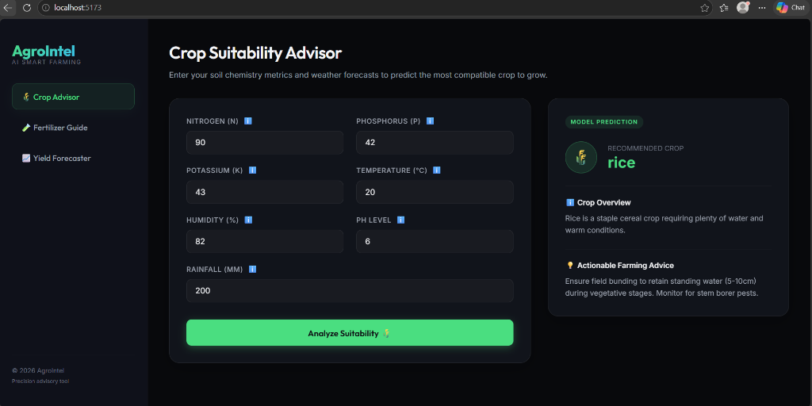
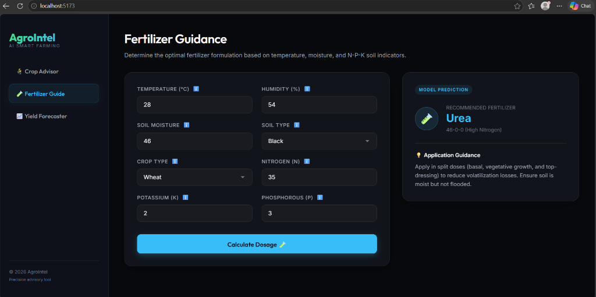
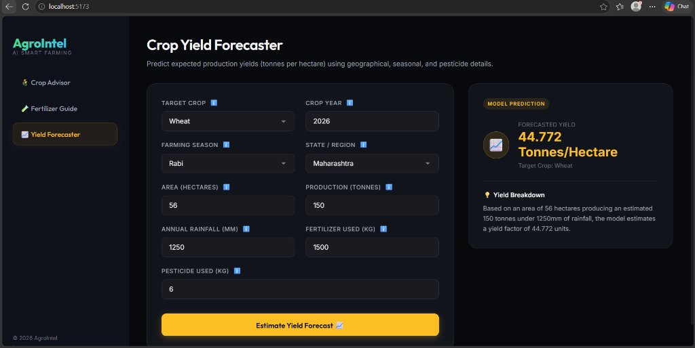

# AgroIntel: AI-Powered Precision Agriculture Advisor

AgroIntel is an advanced full-stack decision-support system designed to empower smallholder farmers, agricultural consultants, and researchers with precision farming insights. By combining historical crop statistics, environmental parameters, and chemical soil structures with machine learning algorithms, the platform delivers actionable recommendations to maximize crop productivity, minimize input waste, and promote sustainable soil management.

---

## 🌾 Core Agronomic Features

* **🌾 Crop Advisor**: Recommends the best crop to cultivate based on soil chemical composition (N, P, K), pH level, and climate parameters (temperature, humidity, rainfall).
  
  

* **🧪 Fertilizer Guide**: Recommends optimal fertilizer dosage (such as Urea, DAP, or specific NPK complex mixes) based on crop type, soil structure (Sandy, Clayey, Loamy, etc.), moisture levels, and soil nutrients.
  
  

* **📈 Yield Forecaster**: Forecasts expected agricultural yield (tonnes/hectare) using historical parameters, regional details, cultivation season, area size, and pesticide usage.
  
  

---

## 🛠️ Technology Stack

* **Frontend**: React 19, Vite, Axios, Vanilla CSS (Premium custom dark/glassmorphic layout)
* **Backend**: Python 3, Flask, Flask-CORS, Gunicorn (WSGI production server)
* **Machine Learning**: Scikit-Learn (Random Forest classifiers and regressors), Joblib, Pandas, NumPy

---

## 📂 Project Directory Structure

```
ai-in-agriculture/
├── backend/
│   ├── app.py                # Flask web service containing API endpoints
│   └── requirement.txt       # Python dependencies (Flask, scikit-learn, etc.)
├── data/
│   ├── Crop_recommendation.csv   # Dataset for Crop Suitability
│   ├── Fertilizer Prediction.csv # Dataset for Fertilizer Guidance
│   └── crop_yield.csv.zip        # Dataset for Yield Forecasting
├── frontend/
│   ├── package.json              # Vite/React configuration
│   ├── index.html                # HTML entry point (google fonts configured)
│   └── src/
│       ├── App.jsx               # Main React Dashboard Component
│       ├── App.css               # Component layout & animations
│       └── index.css             # Base CSS variables & resets
├── models/                       # Trained Random Forest models & Label Encoders
└── notebooks/                    # Jupyter notebooks used for training
```

---

## 💻 Local Installation & Setup

### 1. Run the Backend API
Prerequisite: Python 3.8+ installed.

1. Navigate to the backend directory:
   ```bash
   cd backend
   ```
2. Install Python requirements:
   ```bash
   python -m pip install -r requirement.txt
   ```
3. Run the development server:
   ```bash
   python app.py
   ```
   The backend API will start listening on `http://127.0.0.1:5000`.

### 2. Run the Frontend Dashboard
Prerequisite: Node.js (v18+) installed.

1. Navigate to the frontend directory:
   ```bash
   cd frontend
   ```
2. Install Node dependencies:
   ```bash
   npm install
   ```
3. Launch the local dev server:
   ```bash
   npm run dev
   ```
   Open **`http://localhost:5173/`** in your browser to interact with the application.

---

## 🧠 Machine Learning & Data Methodology

AgroIntel's predictive intelligence relies on robust scikit-learn models trained on diverse agricultural records:

* **Random Forest Classifiers**: Utilized for crop suitability and fertilizer type predictions. These ensemble models construct numerous decision trees during training, outputting the class representing the majority vote. This ensures high classification accuracy (~99% for crop recommendations) and robustness against noisy data.
* **Random Forest Regressors**: Employed for yield estimation, mapping complex multi-dimensional relationships between area, seasonal weather, fertilizer/pesticide levels, and output production to forecast continuous yields with high $R^2$ scores (~90%).
* **Label Encoding Pipelines**: Categorical string inputs (like regions, crops, and soils) are transformed through encoder pipelines to ensure mathematically sound feature maps while preserving human-readable text in the web client.

---

## 🌱 Environmental & Economic Impact

* **Resource Conservation**: By prescribing precise nutrient dosages, AgroIntel helps reduce excess nitrogen application, minimizing harmful nitrous oxide emissions and chemical runoffs into local water tables.
* **Risk Mitigation**: Precision planning protects farmers from planting crops in unsuitable climates, reducing crop failures caused by insufficient rainfall or extreme temperatures.
* **Sustainable Production**: Supports sustainable, high-yield agriculture to feed growing populations while protecting soil microbiology for future generations.
